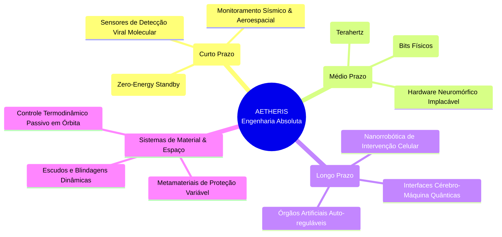

# MAPA MENTAL: A TOPOLOGIA DA ENGENHARIA ABSOLUTA

Este diagrama delineia a escalabilidade do modelo de negócio e da pesquisa na AETHERIS. A partir do domínio fundamental de uma única lei do universo profundo (Efeito Casimir), erguemos múltiplos monopólios industriais impenetráveis.

## 1. Arquitetura da Singularidade Quântica (Mermaid)

## 2. A Filosofia do Mapa e as "Fossas Defensivas"
A AETHERIS opera num princípio de exclusão de concorrentes (Moats / Fossas de Defesa). Uma vez que as bases abaixo estejam patenteadas e funcionalizadas num clean-room, a concorrência global se tornará apenas um cliente licenciador de nossas patentes-raiz.

### Mínima Ação, Eficácia Absoluta
- Ao operar com o tecido de flutuação quântica, excluímos a necessidade de "combustíveis", baterias voláteis e motores suscetíveis ao atrito. Nossas soluções de sensoriamento captam a menor das perturbações – a alteração da assinatura Casimir –, tornando obsoleto tudo o que baseia detecção mecânica ou elétrica convencional.

### Engenharia da Perfeição
- **Biotecnologia de Alto Padrão:** Enquanto o mercado atual prescreve remédios generalistas, a AETHERIS aplicará intervenção cirúrgica microscópica isenta de calor, atrito ou toxicidade, garantindo qualidade de vida irretocável e longevidade àqueles com acesso ao sistema.
- **Luxo Tecnológico e Excelência:** A startup trata o desenvolvimento com um rigor absoluto. Apenas investidores capazes de entender e suportar a visão de construir a tecnologia alfa (da qual todas as outras herdarão a base) poderão participar.
